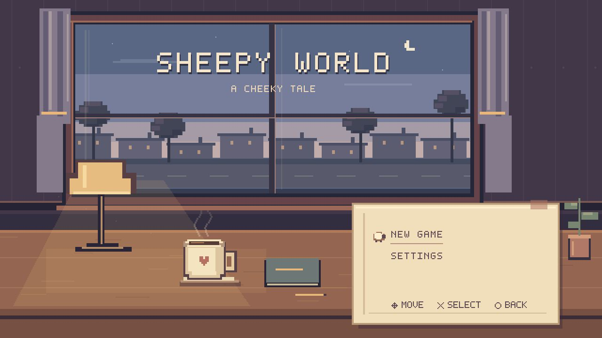
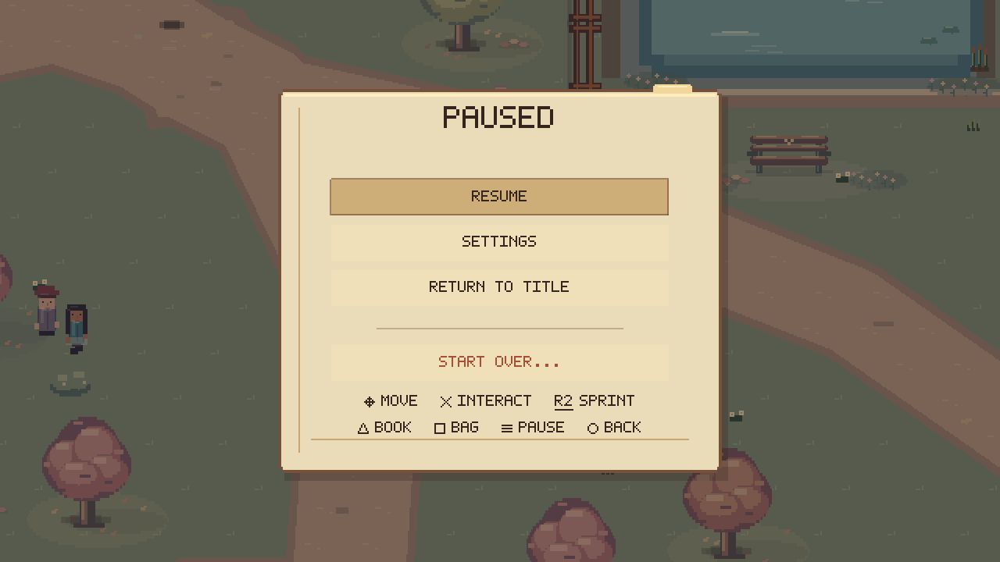
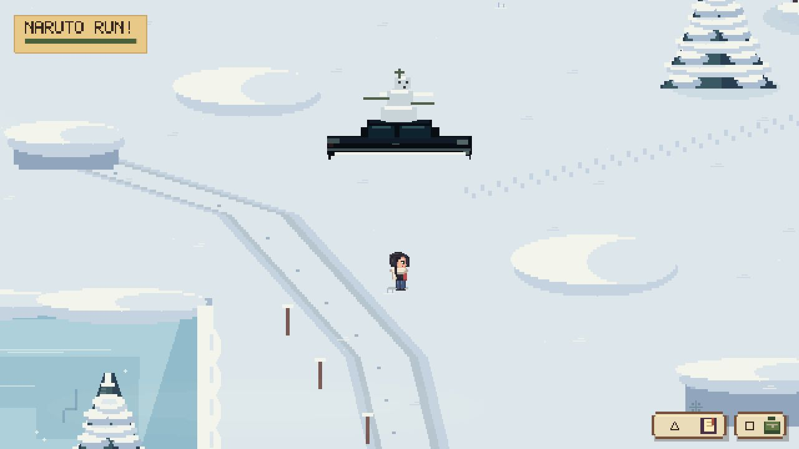
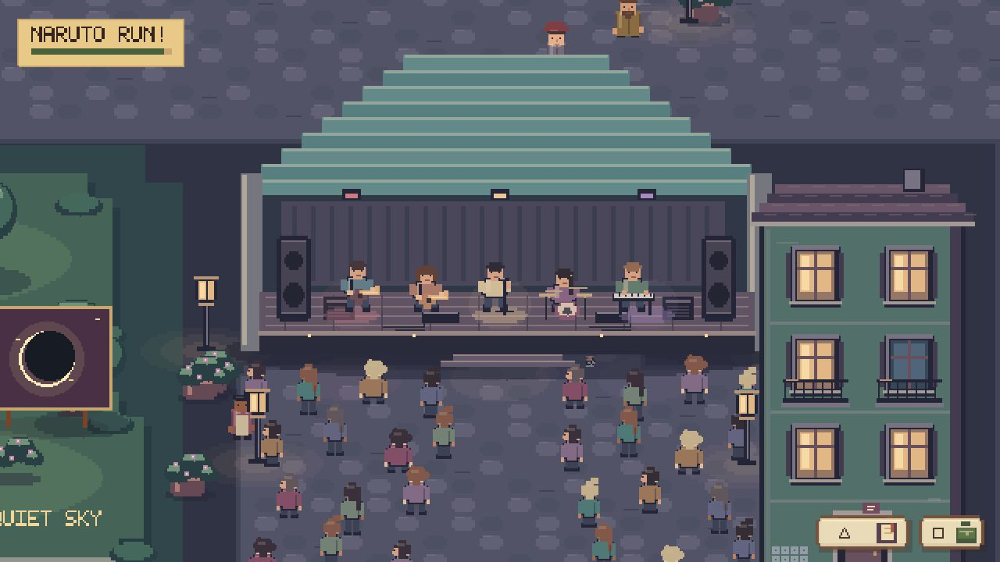
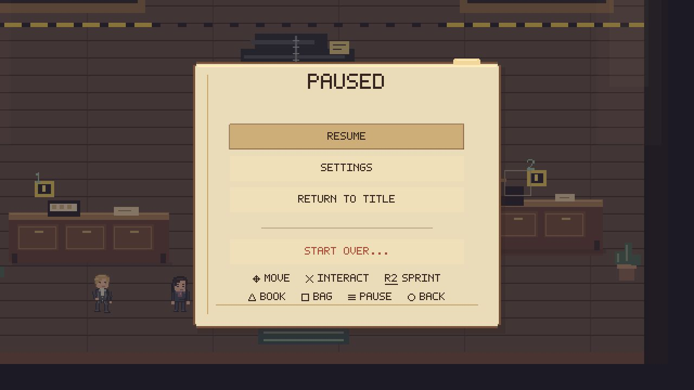
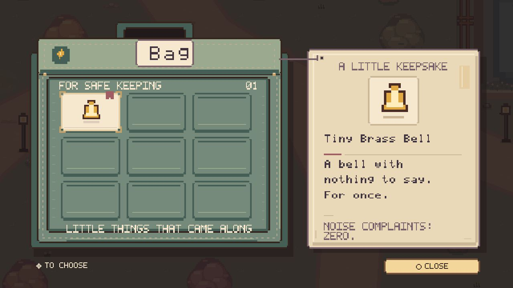
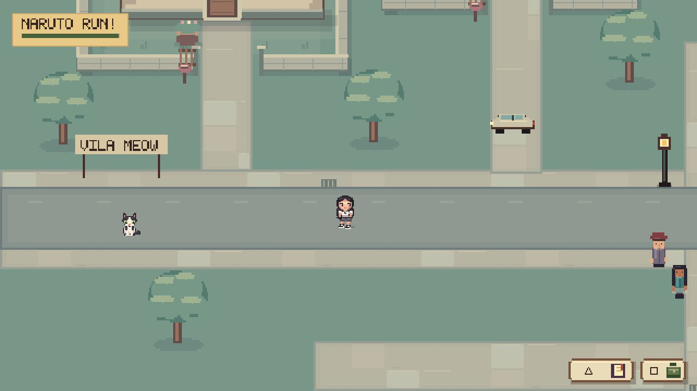
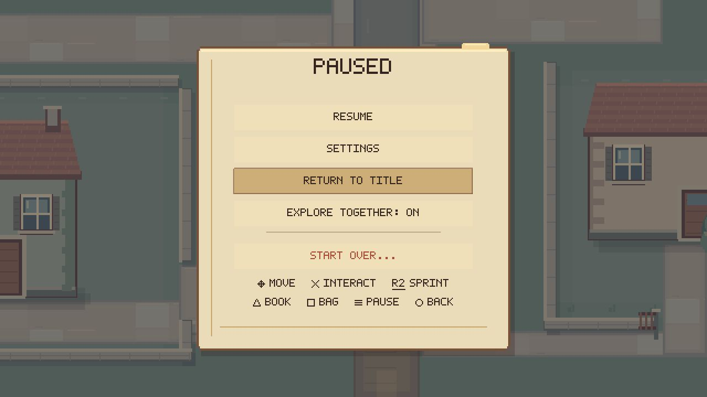

# Sheepy World: A Cheeky Tale

Sheepy World: A Cheeky Tale is a cozy pixel-art exploration game I originally created as a one-year anniversary gift for my girlfriend.

Built around memory, exploration, environmental storytelling, and playful interactions, the project evolved into a complete game featuring multiple regions, dialogue, memory restoration, cats, controller support, original music, and a post-game Together Mode. The player character is based on my girlfriend; I appear as another character. The original private game drew on shared memories and personal experiences without pretending its personal origin was fictional.

> **This repository is a privacy-safe public portfolio edition of the original game.** Personal photographs, videos, private messages, identifying details, and selected relationship-specific content have been removed, generalized, or replaced with clearly fictional placeholders. It is intentionally not byte-identical to the private anniversary release.

## Project Overview

The game follows a protagonist through a connected, code-authored pixel world. Environmental clues gradually turn incomplete scrapbook entries into restored memories, opening a final journey and a post-game mode built around close paired movement and small shared activities.

The canonical presentation is a 640×360 logical canvas. Phaser renders procedural pixel art and authored UI at integer-friendly coordinates, while nearest-neighbour scaling keeps the image crisp at larger window sizes.

## Screenshots

All images below are captured from this sanitized edition. No personal photograph, private letter, exact private date, or private media appears in them.

| | |
| --- | --- |
|  |  |
|  |  |
|  |  |
|  |  |

## Origin

The original Sheepy World was designed as a one-year anniversary game for my girlfriend. Its protagonist, developer character, playful tone, and structure around remembering all come from that origin. This edition keeps that truth because it is central to the work, while separating the public technical showcase from the couple's private archive.

## Design Philosophy

- Keep discovery diegetic: the player notices places, conversations, objects, and changes in the world instead of following a quest list.
- Let ordinary interactions matter alongside larger set pieces.
- Build small authored systems with explicit data rather than one oversized scene.
- Preserve readable pixel silhouettes, limited palettes, integer positioning, and nearest-neighbour presentation.
- Treat privacy as a content boundary, not a reason to erase the project's identity.

## Core Features

- A connected multi-region world spanning Autumn Park, River Town, Vila Meow, Home, Snow, Porto, an old-world festival, a Mentalist-inspired case, and Final Park.
- Four-state memory progression: `UNKNOWN` → `DISCOVERING` → `RESONATING` → `RESTORED`.
- Dialogue graphs with portraits, choices, repeatable and one-shot interactions, and scene events.
- A tactile scrapbook, inventory bag, compact HUD, pause/settings paper, and controller-aware prompts.
- Tobias, Teemi, and Chicho with distinct roaming, directional animation, interaction, and carrying behavior.
- Post-game Together Mode with paired locomotion, hand-holding, synchronized sprinting, couch/TV, sleeping, COF, idle affection, side-switch bump, and playful micro-events.
- Original soundtrack composed and produced by Gonçalo Terroso, with bespoke Scrapbook, Bag/inventory, door, and wider interaction/UI sound design plus curated ambience and SFX integration.
- Keyboard and controller input, versioned saves, original score playback, and a Tauri desktop wrapper.

## World & Exploration

`ParkScene` owns the active world and composes region modules rather than embedding the full game in one scene file. Region definitions separate layout, art, surface queries, collision, interactions, local audio intent, and story hooks. The result is a large world that remains inspectable as focused TypeScript modules.

Porto remains a public setting. Fictional Vila Meow remains intact. Residential mappings, exact private homes, and identifying location details are not included.

## Memory Restoration System

Memories are data definitions with stable IDs, fragment IDs, discovery copy, restored copy, thresholds, regions, and next-step hints. `GameStateStore` is the only mutation boundary for collected fragments, restored memories, inventory, encounters, cats, settings, and story flags.

The public edition retains legacy internal IDs where they protect behavior or save semantics, but player-facing dates and event labels are generalized. The Final Gate still depends on restored anchor memories and a two-part keepsake; its public labels no longer expose the private anniversary date.

## Scrapbook & UI

The scrapbook visualizes discovery state, clue fragments, restoration, living annotations, and late-game guidance. UI modules share paper, fabric, ink, controller-glyph, and pixel-font primitives. Blocking overlays report their state through the game event bus so movement and audio ownership stay coordinated.

The gallery uses four original fictional cards made for this repository: an autumn bench, an empty evening stage, a snow-sheep scene, and a sleeping cat. They demonstrate image loading, galleries, polaroid presentation, and the timed couch callback without reproducing any private photograph.

## Dialogue System

Dialogue is defined as typed node graphs with speakers, lines, optional portraits, choices, completion events, and world-focus metadata. The public edition preserves humor, ordinary couple exchanges, character cameos, and the Mentalist case. Private conversations, sensitive facts, and the anniversary letter are not included.

The final-letter UI remains operational and displays an explicit omission notice rather than invented substitute history.

## Together Mode

Together Mode unlocks after completion and adds a scene-local companion owner. `TogetherMotion` handles safe following, close-pair offsets, hand joins, sprint synchronization, and region re-entry. `TogetherState` owns elapsed-time micro-events and activity transitions. `TogetherWorld` binds those systems to authored interaction anchors.

For this public edition, the contextual prompt is **“Switch sides?”**. Activation still turns the pair back-to-back, performs the tiny contact movement, displays **BUMP**, and preserves the original cooldown/state behavior. The pinch system remains, but its private physical-detail callback was replaced with the generic **“Got your nose!!!”** line.

## Cat System

Tobias, Teemi, and Chicho keep their names and approved game sprites. Cat behavior is divided between data, `CatActor`, `CatMotion`, region-specific composition, final-journey following, and save-backed ownership state. No real reference photograph of any cat is included.

## Sound Design & Original Music

Audio was a hands-on part of the project's creative direction. **Gonçalo Terroso composed and produced the original Sheepy World soundtrack.** He also created and designed the custom Scrapbook sounds, Bag/inventory sounds, door sounds, and wider interaction/UI sound work that helped give the game its tactile character.

For the remaining sound effects and environmental ambience used by the original game, Gonçalo curated, selected, and integrated the material to fit each scene and interaction. This curation and audio direction should not be read as a claim that he personally recorded or composed every ambience or remaining SFX.

The authored audio palette is connected to the runtime through `AudioSystem`: channel mixing, settings, emitter ownership, focus/unlock recovery, spatial intent, and modal ducking coordinate how music, ambience, UI feedback, and interactions behave in play.

This privacy-safe repository intentionally distributes only the approved public audio: `public/assets/audio/music/sheepy-world-theme.mp3`, the original instrumental score, with its ID3 metadata stripped. The original private version used a broader audio set; some of that audio is deliberately not distributed here, and optional excluded sounds resolve silently without making the public build dependent on private assets.

## Controller / Input

Controls are centralized and presented through keyboard or controller-aware glyphs. The game supports movement, sprinting, interactions, dialogue choices, Bag, Scrapbook, pause/settings, Together actions, and context-sensitive back behavior without scattering key labels through scene code.

## Save Architecture

`SaveRepository` persists a schema-versioned document to browser storage. `sanitizeSave` validates and migrates supported legacy versions before state reaches the game. `GameStateStore` exposes focused mutations and subscriptions, while transient movement and Together runtime state remain out of the save payload.

## Desktop Packaging

Tauri 2 source and icons are included to demonstrate the Windows desktop wrapper. A prebuilt Windows installer is intended to be provided through GitHub Releases after local review; no release link is published here yet. The downloadable build is the same privacy-safe portfolio edition represented by this repository and contains no private anniversary media.

The installer is not stored in the tracked source. You can still build the wrapper locally to inspect the desktop integration. The public installer uses Tauri's WebView2 download bootstrapper when WebView2 is not already available, rather than bundling the full offline WebView2 payload.

This portfolio build is not code-signed. Windows SmartScreen may therefore show an **Unknown Publisher** warning; review the release and its checksum, and do not weaken Windows security settings.

## Tech Stack

Versions below are taken from the checked lockfiles in this edition.

| Technology | Locked version | Role |
| --- | ---: | --- |
| Phaser | 3.90.0 | Game runtime, scenes, input, cameras, audio, tweens |
| TypeScript | 5.9.3 | Typed gameplay, UI, data, and tests |
| Vite | 7.3.6 | Development server and production web build |
| Vitest | 3.2.7 | Unit, integration, content, and regression tests |
| ESLint | 9.39.5 | Static analysis |
| Tauri CLI | 2.11.4 | Desktop development and packaging |
| Tauri crate | 2.11.5 | Rust desktop runtime |

## Testing / QA

The suite covers movement timing, save migration, interactions, memory states, dialogue choices, art contracts, region composition, audio routing, cats, Together Mode, title flow, and completion. Public-specific tests lock the omission notice, placeholder-media allowlist, and Together wording.

An additional repository scan checks for forbidden directories, installers, archives, videos, WAV masters, private media routes, local developer paths, obvious secret formats, the protagonist's private name, private callback wording, exact public-facing date tokens, and unexpected public assets.

```powershell
npm run privacy
npm test
npm run typecheck
npm run lint
npm run build
```

## Public Portfolio Edition

This version differs deliberately from the original private anniversary release:

- Personal photographs and videos are absent; four fictional illustrated cards demonstrate the media systems.
- The private anniversary letter and personal wish are replaced by explicit omission notices.
- The protagonist's real name, identifying labels, exact private dates, selected locations, and event names are generalized.
- Selected private dialogue and inside-joke details are replaced with transparent or neutral public copy.
- Together Mode keeps its behavior while the side-switch prompt and one pinch callback use public-safe wording.
- The original private version used a broader audio set. This edition distributes only the approved public-safe original instrumental; other original-version audio remains intentionally outside this repository.
- The original private release, installer, build history, and source references remain separate.

Placeholders are not presented as original relationship content. They exist only to keep the public build runnable and the underlying systems reviewable.

## Development Approach

Concepted, designed, creatively directed, iterated, tested, and manually reviewed by Gonçalo Terroso. His direct creative authorship also includes the original music, bespoke sound design, and curation and integration of the wider audio palette.

Developed through an AI-assisted workflow combining hands-on creative direction, systems design, iterative implementation, runtime testing, and manual visual QA. AI-assisted implementation was used as a development tool; creative and release decisions remained actively directed and reviewed.

See [Architecture](docs/ARCHITECTURE.md) for the privacy-safe system map.

## Run Locally

For visitors who only want to play, the reviewed prebuilt Windows installer is intended for GitHub Releases and does not require Node.js, npm, Rust, Cargo, Visual Studio, Git, Tauri, or a terminal. The local-source workflow below remains available for reviewers and developers.

Prerequisites: Node.js `^20.19.0` or `>=22.12.0`.

```powershell
npm install
npm run dev
```

Open the local URL printed by Vite. The project has no dependency on the private repository, `references/`, local secret files, or personal media.

## Build

Web build:

```powershell
npm run build
```

Desktop development/build additionally requires Rust and the platform prerequisites for Tauri 2:

```powershell
npm run desktop:dev
npm run desktop:build
```

Compiled application binaries and installers remain outside this repository's tracked source. After review, the prebuilt Windows installer is intended to be distributed separately through GitHub Releases.

## Project Status

The original private game and Windows release are complete and release-frozen. This repository is a separate portfolio-safe edition prepared for source review and local builds. It is not a redesign for a future commercial project.

## Author / Portfolio

**Gonçalo Terroso** — concept, design, creative direction, development, and QA.

Portfolio: [goncaloterroso.com](https://goncaloterroso.com)

© 2026 Gonçalo Terroso. All rights reserved. No open-source license is granted by the presence of this source portfolio.
