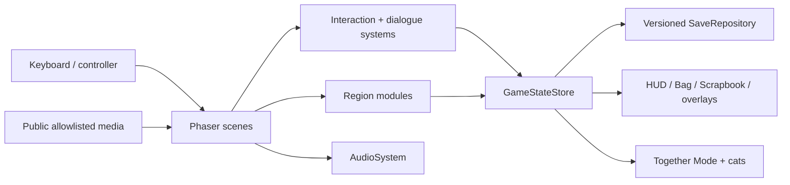

# Architecture

## Context and goals

Sheepy World: A Cheeky Tale is a Phaser game presented on a 640×360 logical canvas and optionally wrapped by Tauri. The codebase favors small authored modules, typed data, centralized state mutation, and procedural pixel art. This document describes the privacy-safe public edition only.

## High-level flow

## Runtime boundaries

### Scenes

- `BootScene` preloads the explicit audio and placeholder-image allowlists, generates procedural textures, and selects the initial scene.
- `TitleScene` owns the scrapbook-desk menu and title flow.
- `ParkScene` owns the active explorable world, player, camera, interactions, regional composition, and scene-local systems.
- `UIScene` owns non-world presentation: HUD, Bag, Scrapbook, dialogue, pause/settings, galleries, and ending overlays.
- `ArtGalleryScene` is a development-only visual review surface.

### State and persistence

`GameStateStore` is the mutation boundary for durable game state. Callers collect fragments, restore memories, add artifacts, update cat state, record encounters, and set flags through focused methods rather than editing the save object directly.

`SaveRepository` serializes the current schema to browser storage. `sanitizeSave` validates supported historical versions, applies defaults, deduplicates collections, and prevents malformed data from entering the store. Movement stamina, scene locks, and active Together transitions are session state and are intentionally not serialized.

### Regions and world composition

Region definitions provide bounds, entrances, exits, surfaces, and scene builders. Focused modules add art, solids, interactions, story moments, cats, and local effects. `ParkScene` coordinates transitions without turning the world into a single monolithic scene file.

The public edition keeps Porto and the fictional Vila Meow. It contains no address, coordinate, or mapping from a fictional home to a real residence.

### Interaction and dialogue

`InteractionSystem` ranks nearby typed targets, manages prompts, and commits interactions. Dialogue definitions are data graphs containing nodes, speakers, lines, choices, portraits, next-node edges, and completion events. UI consumes those definitions without owning story state.

### Memory and scrapbook

Memory definitions describe fragments, discovery copy, restoration thresholds, themes, regions, and guidance. The UI derives one of four states—`UNKNOWN`, `DISCOVERING`, `RESONATING`, or `RESTORED`—from the definition and the current save. Final Gate checks reuse this data rather than maintaining a second progression model.

Legacy internal IDs are retained only where they protect progression or migration semantics. Public-facing labels for exact dates and private events are generalized.

### Together Mode

- `TogetherState` owns activity mode, cooldowns, and elapsed-time micro-events.
- `TogetherMotion` computes safe joins, following offsets, hand-holding distance, paired sprint behavior, and transition recovery.
- `TogetherWorld` is the scene-local owner that binds the model to sprites, prompts, activity anchors, couch/TV, sleeping, COF, pinch, fart, idle affection, and the side-switch bump.

The public prompt is `Switch sides?`; the behavior and `BUMP` feedback are unchanged. The private physical-detail callback is replaced by a generic playful line.

### Cats

Cat definitions and generated sprites are separated from motion. `CatActor`, `CatMotion`, regional cat modules, and save-backed ownership cooperate without embedding cat behavior in the player entity. Tobias, Teemi, and Chicho retain their names and approved runtime art.

### Audio

Content authorship and runtime architecture are separate concerns. Gonçalo Terroso composed and produced the original soundtrack; created the bespoke Scrapbook, Bag/inventory, door, and wider interaction/UI sounds; and curated and integrated the remaining SFX and environmental ambience used by the original game. Curation does not imply that every remaining ambience or SFX was personally recorded or composed by him.

`AudioSystem` owns channels, effective gain, playback slots, loop lifetimes, browser unlock/focus behavior, spatial emitters, and modal ducking. The public asset manifest registers only the approved public-safe original Sheepy World instrumental. The original private version used a broader audio set; calls for audio intentionally excluded from this portfolio edition fail silently, preserving gameplay while demonstrating the system boundary.

### Public media boundary

`personalPhotos.ts` is retained as a compatibility-oriented presentation API, but its public allowlist contains only four fictional illustrations created for this edition. The build plugin emits only assets referenced by the audio and gallery manifests. There is no dynamic filesystem discovery and no route into private source material.

The repository-level privacy check rejects unapproved public assets, videos, WAV files, installers, archives, source maps, private directories, local machine paths, obvious secret formats, and known private content markers.

### Desktop wrapper

`src-tauri/` contains the Rust entry point, Tauri configuration, Cargo lockfile, and public icons. Generated schemas, `target/`, the private installer, and offline WebView payloads are outside the public source boundary.

## Key trade-offs

- Procedural art keeps the visual source reviewable and avoids a large opaque asset bundle, at the cost of more drawing code.
- Stable data IDs reduce migration risk even when public-facing wording changes.
- Explicit allowlists make media additions deliberate, but require a manifest update and privacy review for every new asset.
- Scene-local runtime owners simplify teardown and prevent duplicate listeners, at the cost of careful lifecycle wiring.
